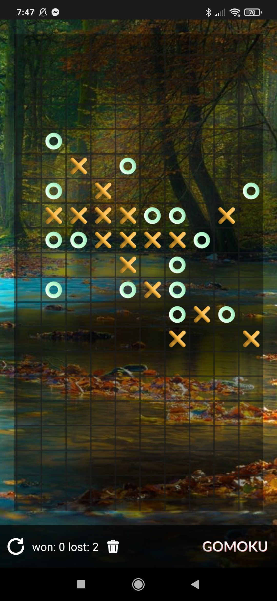

# Gomoku Game - Mobile App

## Overview
This simple mobile application was built for fun in React Native. You're more than welcome to fork it
as well as contribute to it.

The application is built using React Native and expo. Expo eject has been used, so each project can be opened in Xcode and Android Studio.



## Installation

#### 1. Clone the repository and install [npm](https://www.npmjs.com/) packages

```$ npm install```

#### 2. Start [expo](https://docs.expo.dev/get-started/installation/)

```expo start```

## The Game

### The current features

- Play the game against the "machine"
- Start a new game
- Clear the statistics

### Planned features for future versions

- Make difficulty levels
- Make configurable who plays "X" and "O" as well as who is starting the game
- Make it possible to play the game against another human
- Make the game area size editable for the user

### The game logic

The game logic is rather simple. It is looking for patterns where each has a certain priority.
For example: 

`| X | X | X |   | X |` is the top most priority to be updated to `| X | X | X | O | X |`

The board is scanned for a set of predefined patterns `/data/patterns.json` horizontally, vertically and diagonally.

### Testing

Currently, there is no test coverage.